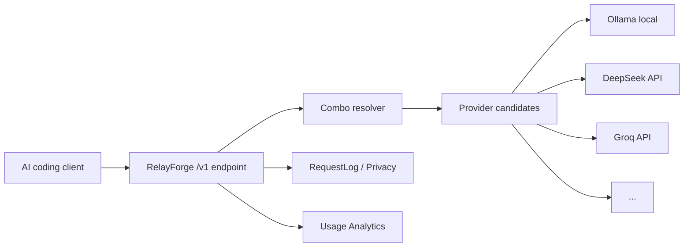

# RelayForge v0.1.0

**Zero-dependency local-first AI coding gateway** — OpenAI / Anthropic compatible.
Unify your local (Ollama / LM Studio) and cloud API providers behind `http://127.0.0.1:18765/v1` with combo routing,
fallback, request privacy, and lightweight usage analytics.

[](LICENSE)
[](package.json)
[]()
[]()

---

## Why RelayForge?

AI coding tools (Codex, opencode, Claude Code, CC Switch, Cline) need access to multiple LLM providers.
Managing API keys, rate limits, fallback behavior, and privacy across every tool is painful.
RelayForge gives you a single local endpoint that handles it all — with zero npm dependencies.



## Features

- **Zero dependencies** — runs on Node.js built-ins only
- **Local-first** — binds to `127.0.0.1` by default, no telemetry, no cloud lock-in
- **OpenAI / Anthropic compatible** — `/v1/chat/completions`, `/v1/messages`, `/v1/responses`, `/v1/models`
- **Combo models** — virtual model names that combine multiple providers with fallback / round_robin / weighted_round_robin
- **Smart fallback** — 429/503/timeout triggers cascade to the next candidate
- **Privacy by default** — prompts are never logged; API keys are redacted
- **Recent requests** — last 20 request metadata (model, provider, latency, status) without prompt content
- **Provider registry** — capability-based provider queries (`openai_chat`, `anthropic_messages`, `streaming`, `tools`...)
- **No OAuth subscription tokens** — RelayForge does not read or forward Claude Code / Codex / Cursor personal tokens

## Quick Start

### A. Windows zip users

1. Unzip `relayforge-0.1.0.zip`
2. Double-click **`Start_RelayForge.cmd`**
3. Open http://127.0.0.1:18765 in your browser
4. Copy the token from the startup log
5. In your AI coding tool, set:
   ```
   Base URL: http://127.0.0.1:18765/v1
   API Key:  <RELAYFORGE_TOKEN from startup log>
   Model:    smart-coding
   ```

### B. PowerShell users

```powershell
$env:RELAYFORGE_TOKEN = "my-local-token"
$env:RELAYFORGE_PORT  = "18765"
node src/server.js
```

### C. macOS / Linux / WSL users

```bash
export RELAYFORGE_TOKEN="my-local-token"
export RELAYFORGE_PORT="18765"
node src/server.js
```

### D. Verify with curl

```bash
# List models
curl http://127.0.0.1:18765/v1/models \
  -H "Authorization: Bearer my-local-token"

# Chat completion
curl http://127.0.0.1:18765/v1/chat/completions \
  -H "Authorization: Bearer my-local-token" \
  -H "Content-Type: application/json" \
  -d '{"model":"smart-coding","messages":[{"role":"user","content":"Hello!"}]}'

# Admin status
curl http://127.0.0.1:18765/admin/status \
  -H "Authorization: Bearer my-local-token"
```

## Client Setup

### CC Switch

```
Name: RelayForge
Base URL: http://127.0.0.1:18765/v1
API Key: <RELAYFORGE_TOKEN>
Model: smart-coding (or any combo/route/provider:model)
```

### opencode

```json
{
  "agents": {
    "defaults": {
      "model": { "primary": "smart-coding" }
    }
  },
  "models": {
    "providers": {
      "relayforge": {
        "baseUrl": "http://127.0.0.1:18765/v1",
        "apiKey": "<RELAYFORGE_TOKEN>",
        "api": "openai-completions",
        "models": [{ "id": "smart-coding" }]
      }
    }
  }
}
```

### Codex / OpenAI-compatible clients

```bash
export OPENAI_BASE_URL="http://127.0.0.1:18765/v1"
export OPENAI_API_KEY="<RELAYFORGE_TOKEN>"
```

### Claude Code (OpenAI-compatible mode)

```bash
export ANTHROPIC_BASE_URL="http://127.0.0.1:18765/v1"
export ANTHROPIC_API_KEY="<RELAYFORGE_TOKEN>"
```

> **Security note:** RelayForge uses API-key based configuration. It does not read or forward OAuth subscription tokens from Claude Code, Codex, or Cursor. Your upstream provider credentials stay under your control.

## Configuration

### Providers

```json
{
  "providers": [
    { "name": "ollama", "baseUrl": "http://127.0.0.1:11434/v1", "models": ["qwen2.5:7b"] },
    { "name": "deepseek", "baseUrl": "https://api.deepseek.com/v1", "keyEnv": "DEEPSEEK_API_KEYS", "models": ["deepseek-chat"] }
  ]
}
```

### Routes

Routes define named model groups with fallback/round_robin/weighted strategies:

```json
{
  "routes": [{
    "name": "coding-local",
    "strategy": "fallback",
    "candidates": [
      { "provider": "deepseek", "model": "deepseek-chat", "weight": 3 },
      { "provider": "ollama", "model": "qwen2.5:7b", "weight": 1 }
    ]
  }]
}
```

### Combo Models (v0.1.0)

Combos are virtual models with built-in health-aware routing:

```json
{
  "combos": [{
    "name": "smart-coding",
    "strategy": "fallback",
    "candidates": [
      { "provider": "deepseek", "model": "deepseek-chat", "weight": 3, "priority": 2, "enabled": true },
      { "provider": "groq", "model": "llama-3.1-8b-instant", "weight": 2, "priority": 1, "enabled": true },
      { "provider": "ollama", "model": "qwen2.5:7b", "weight": 1, "priority": 0, "enabled": true }
    ]
  }, {
    "name": "weighted-pool",
    "strategy": "weighted_round_robin",
    "candidates": [
      { "provider": "deepseek", "model": "deepseek-chat", "weight": 5 },
      { "provider": "siliconflow", "model": "Qwen/Qwen2.5-7B-Instruct", "weight": 2 },
      { "provider": "ollama", "model": "qwen2.5:7b", "weight": 1 }
    ]
  }]
}
```

Use `profile.defaultModel` to reference combo names:

```json
{
  "profiles": [{
    "name": "coding",
    "defaultModel": "smart-coding"
  }]
}
```

### Privacy

```json
{
  "privacy": {
    "logPrompts": false,
    "logHeaders": false
  }
}
```

Prompts are never stored in dashboard logs by default.

## Environment Variables

| Variable | Recommended | Legacy (backward compat) |
|----------|-------------|-------------------------|
| `RELAYFORGE_TOKEN` | ✅ Token for /v1/* and /admin/* | `RELAY_TOKEN` / `OPENRELAY_TOKEN` |
| `RELAYFORGE_CONFIG` | ✅ Custom config path | `OPENRELAY_CONFIG` |
| `RELAYFORGE_STATE` | ✅ Custom state path | `OPENRELAY_STATE` |
| `RELAYFORGE_PORT` | ✅ Port override | `PORT` / `OPENRELAY_PORT` |
| `RELAYFORGE_ALLOW_NO_AUTH` | ✅ Disable auth (dev only) | `OPENRELAY_ALLOW_NO_AUTH` |

If both `RELAYFORGE_*` and `OPENRELAY_*` are set, `RELAYFORGE_*` takes precedence.

## Comparison

| | RelayForge | LiteLLM | One API | 9Router |
|---|---|---|---|---|
| Dependencies | **Zero npm** | Heavy | Heavy | Heavy |
| Local-first | ✅ | ❌ | ❌ | ❌ |
| OAuth token routing | ❌ | ❌ | ❌ | ✅ |
| Combo models | ✅ | ✅ | ❌ | ✅ |
| Privacy logs | ✅ | ❌ | ❌ | ❌ |
| MIT License | ✅ | ✅ | ✅ | ✅ |

## Roadmap

**v0.1.x** — Polish docs, screenshots, demo GIFs, client setup guides, CI stabilization

**v0.2.x** — Better dashboard UX, provider health page, config import/export, config validation UI, token/cost estimation

**v0.3.x** — Plugin-like provider templates, more AI coding client presets, optional local encrypted secrets, Docker support

**Not planned:** OAuth subscription routing, cloud-hosted key sync, built-in account sharing, bypassing provider rate limits, storing full prompts by default.

---

[MIT License](LICENSE) · [Third Party Notices](THIRD_PARTY_NOTICES.md) · [Release Notes](docs/release-v0.1.0.md)
