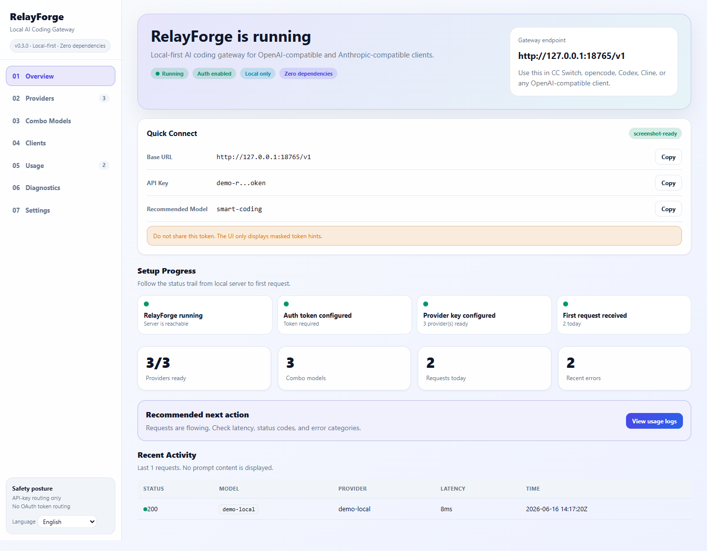
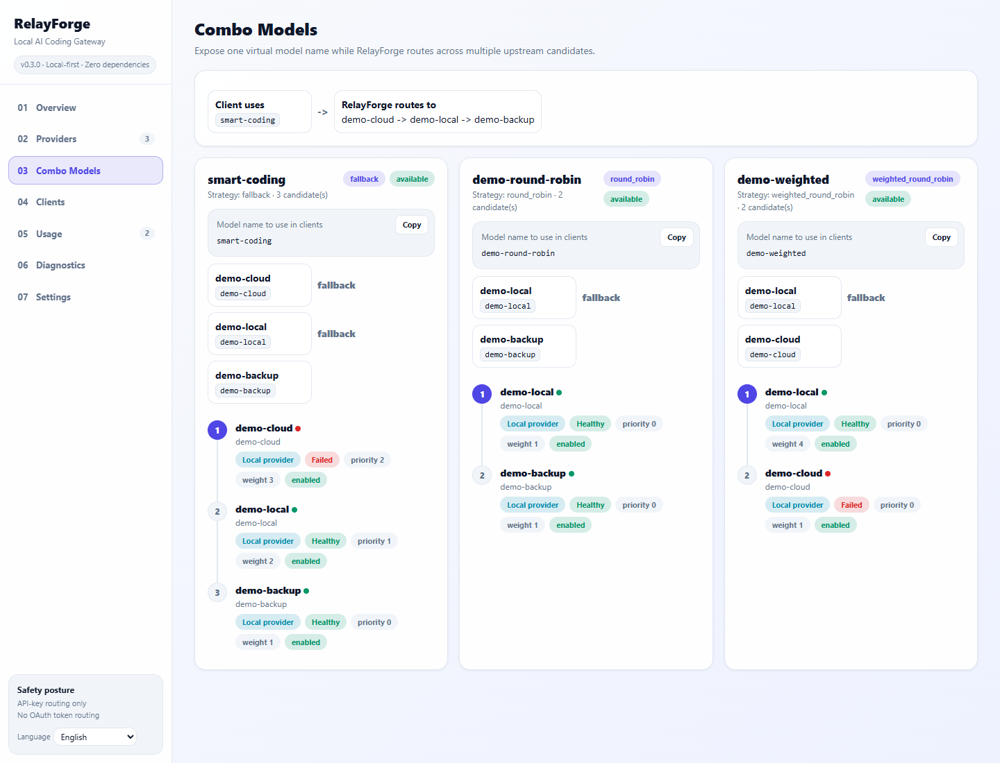
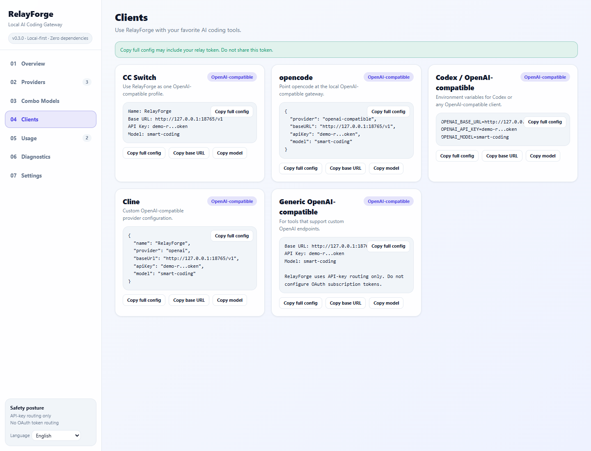
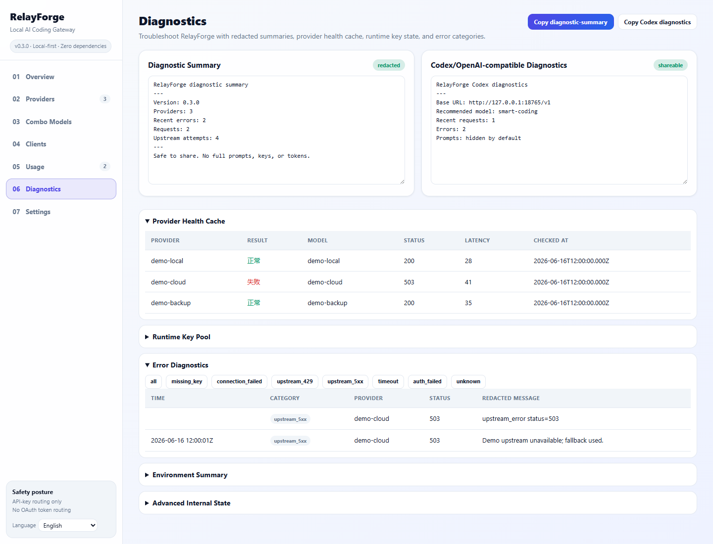
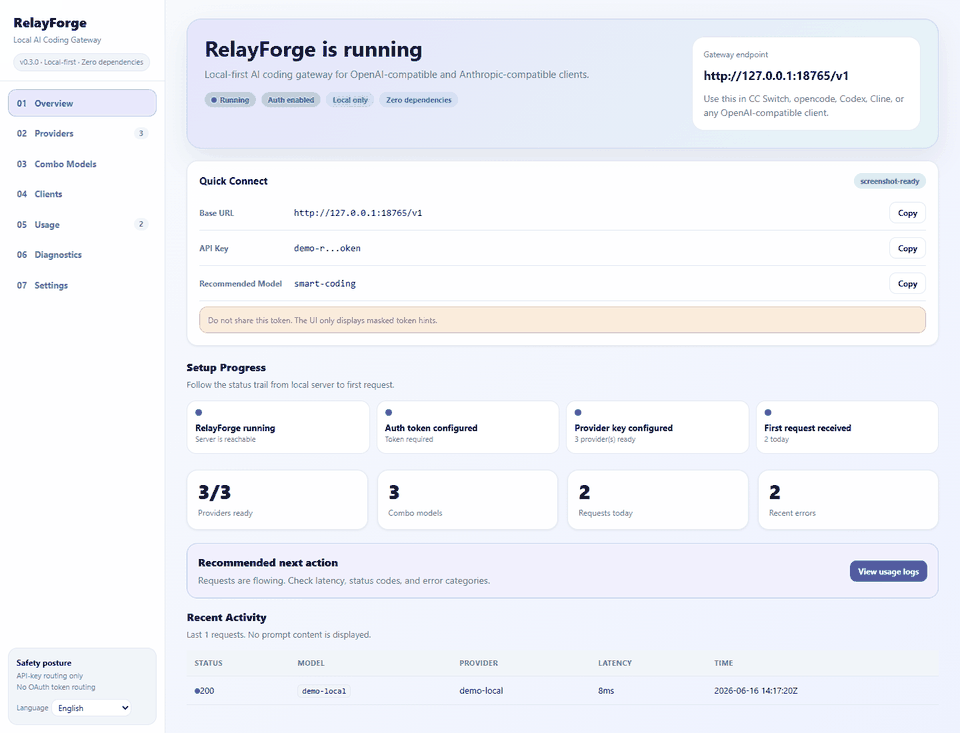
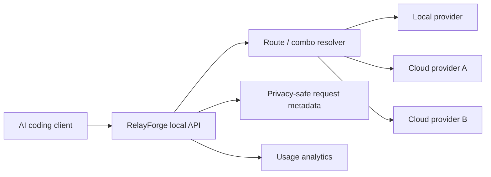

# RelayForge

[](https://github.com/jiezeng2004-design/relay-forge/actions/workflows/ci.yml)
[](LICENSE)
[]()
[]()

> **One local endpoint for all your AI coding providers.**
>
> Stop reconfiguring Codex, OpenCode, Claude-compatible clients and other coding tools every time you switch model providers.

RelayForge is a **zero-dependency, local-first AI gateway** that puts local models and cloud APIs behind one OpenAI / Anthropic-compatible endpoint:

Current release: **v0.3.3**. It is distributed as a local zip / source / container project, not as an npm package.

```text
http://127.0.0.1:18765/v1
```

You configure your providers once. Your coding clients talk to RelayForge. RelayForge handles routing, fallback, privacy-safe request metadata and lightweight usage analytics.

## The problem

A typical AI coding setup grows messy fast:

```text
Codex      → Provider A config
OpenCode   → Provider B config
Cline      → Provider C config
Other tool → another set of keys and URLs
```

Then one provider rate-limits, a cheap endpoint becomes unstable, or you want to move a model back to Ollama.

RelayForge turns that into:

```text
AI coding clients
      ↓
RelayForge
      ↓
smart-coding / combo routes
      ↓
Ollama / LM Studio / DeepSeek / Groq / other providers
```

Your clients keep one local Base URL while routing changes happen behind it.

## What you get

- **One local endpoint** for multiple coding clients.
- **OpenAI + Anthropic-compatible APIs** for common chat/message/response flows.
- **Combo models** that can route across multiple providers.
- **Fallback** when a candidate hits 429, 503 or timeouts.
- **Round-robin / weighted round-robin** routing options.
- **Local-first privacy**: prompts are not written to the request log.
- **Redacted credentials**: API keys are not exposed in dashboard/log output.
- **Lightweight usage visibility**: model, provider, latency and status metadata.
- **Zero npm runtime dependencies**.
- **No subscription-token scraping**: RelayForge does not read Codex, Claude Code or Cursor personal OAuth tokens.

## Dashboard

| Overview | Combo Models |
| --- | --- |
|  |  |

| Clients | Diagnostics |
| --- | --- |
|  |  |

Fallback demo:



## Quick start

### Windows zip

1. Download the latest RelayForge zip from Releases.
2. Extract it.
3. Double-click `Start_RelayForge.cmd`.
4. Open `http://127.0.0.1:18765`.
5. Copy the local token from the startup log.

Then point your coding client to:

```text
Base URL: http://127.0.0.1:18765/v1
API Key:  <RELAYFORGE_TOKEN>
Model:    smart-coding
```

### PowerShell

```powershell
$env:RELAYFORGE_TOKEN = "my-local-token"
$env:RELAYFORGE_PORT = "18765"
node src/server.js
```

### macOS / Linux / WSL

```bash
export RELAYFORGE_TOKEN="my-local-token"
export RELAYFORGE_PORT="18765"
node src/server.js
```

## Docker

RelayForge also ships a GHCR container image.

```bash
docker run -d --name relayforge \
  -p 18765:18765 \
  -v relayforge-data:/app/data \
  -v ./config.json:/app/config.json:ro \
  ghcr.io/jiezeng2004-design/relayforge:latest
```

Get the generated token from logs:

```bash
docker logs relayforge 2>&1 | grep "local relay token"
```

Or use Compose:

```bash
docker compose up -d
```

With the optional local Ollama sidecar:

```bash
docker compose --profile local up -d
```

## Client setup

### Codex / OpenAI-compatible clients

```bash
export OPENAI_BASE_URL="http://127.0.0.1:18765/v1"
export OPENAI_API_KEY="<RELAYFORGE_TOKEN>"
```

### OpenCode

Use RelayForge as an OpenAI-compatible provider:

```text
Base URL: http://127.0.0.1:18765/v1
API Key:  <RELAYFORGE_TOKEN>
Model:    smart-coding
```

RelayForge authenticates `/v1/*` by default. If OpenCode is given only the Base URL, requests will fail with 401. Use the same local token printed at startup, then choose `smart-coding` or any route/combo model exposed by RelayForge.

### Claude-compatible clients

For clients that support a configurable Anthropic-compatible endpoint:

```bash
export ANTHROPIC_BASE_URL="http://127.0.0.1:18765/v1"
export ANTHROPIC_API_KEY="<RELAYFORGE_TOKEN>"
```

RelayForge uses API-key based provider configuration. It does **not** extract or forward personal subscription OAuth tokens from Codex, Claude Code, Cursor or similar apps.

## Combo models

The most useful RelayForge feature is the ability to expose one virtual model name backed by several real providers.

Example idea:

```text
smart-coding
   ├─ DeepSeek primary
   ├─ Groq fallback
   └─ Ollama local fallback
```

Depending on the configured strategy, candidates can be used as:

- fallback;
- round robin;
- weighted round robin.

That means your coding client can continue asking for `smart-coding` even while you change the actual providers behind it.

## Why local-first matters

RelayForge binds to `127.0.0.1` by default and is designed to keep the control plane on your machine.

Privacy defaults include:

- prompts are not stored in the recent-request log;
- provider API keys are redacted;
- local state stays on your machine unless you explicitly mount or sync it elsewhere;
- Docker images do not bake your `.env`, `config.json` or provider secrets into the image.

## Verify the gateway

Use the local token printed at startup as a Bearer credential.

List models:

```bash
curl http://127.0.0.1:18765/v1/models \
  -H "Authorization: Bearer <RELAYFORGE_TOKEN>"
```

Send a chat completion:

```bash
curl http://127.0.0.1:18765/v1/chat/completions \
  -H "Authorization: Bearer <RELAYFORGE_TOKEN>" \
  -H "Content-Type: application/json" \
  -d '{"model":"smart-coding","messages":[{"role":"user","content":"Hello"}]}'
```

Do not paste the local token into README examples, screenshots, or git commits.

## What RelayForge is not

- It is not a cloud proxy service.
- It does not sell model access.
- It does not scrape consumer subscription tokens.
- It does not make an unstable upstream provider reliable by magic; it gives you routing and fallback options when multiple candidates are available.
- It does not log prompt bodies for analytics.

## Architecture


```mermaid
flowchart LR
  A[AI coding client] --> B[RelayForge local API]
  B --> C[Route / combo resolver]
  C --> D1[Local provider]
  C --> D2[Cloud provider A]
  C --> D3[Cloud provider B]
  B --> E[Privacy-safe request metadata]
  B --> F[Usage analytics]
```

The project intentionally keeps the runtime small and uses Node.js built-ins instead of a large dependency tree.

## Project philosophy

RelayForge is for people who want to change **providers without reconfiguring every client**.

The product boundary is simple:

```text
Clients know RelayForge.
RelayForge knows providers.
```

That separation is what makes fallback, routing and provider switching useful.

## License

MIT. See [LICENSE](LICENSE).
