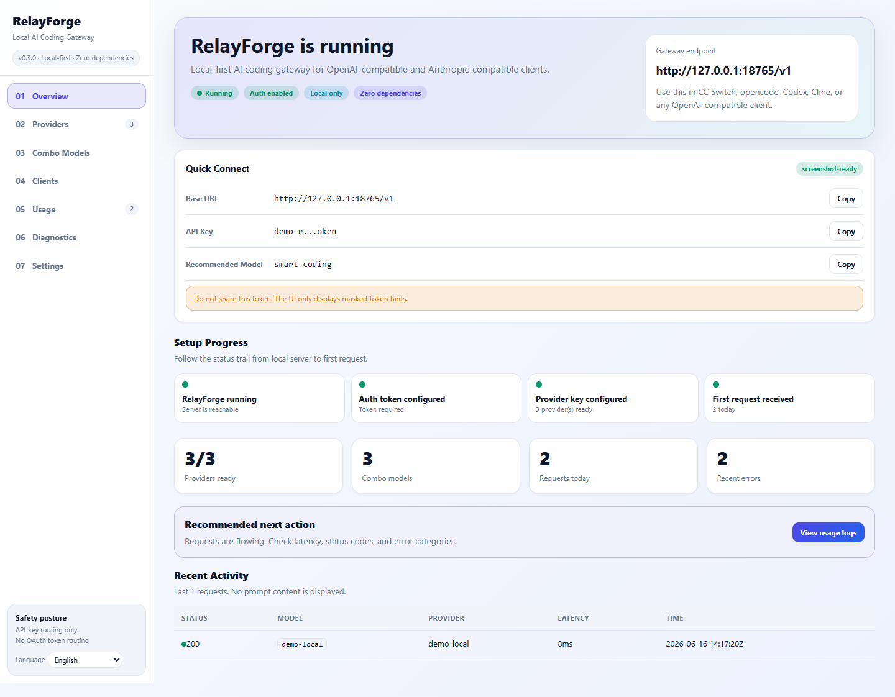
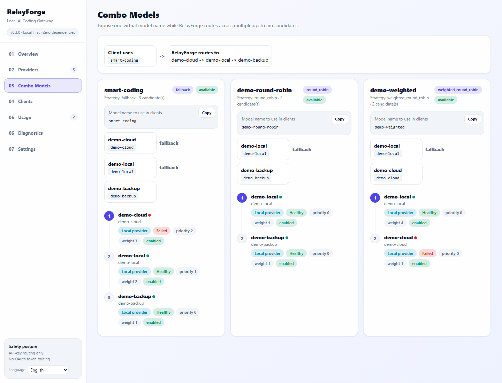
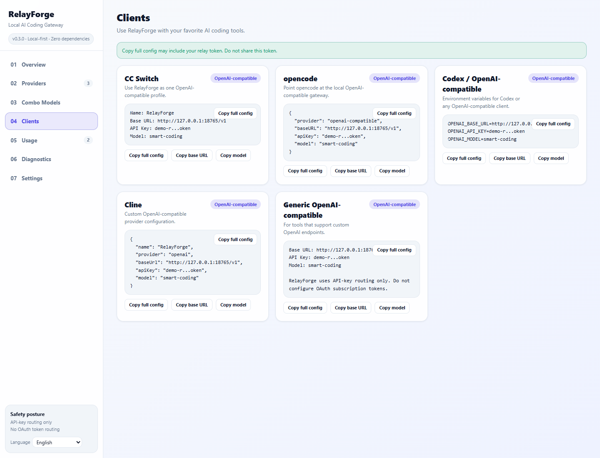
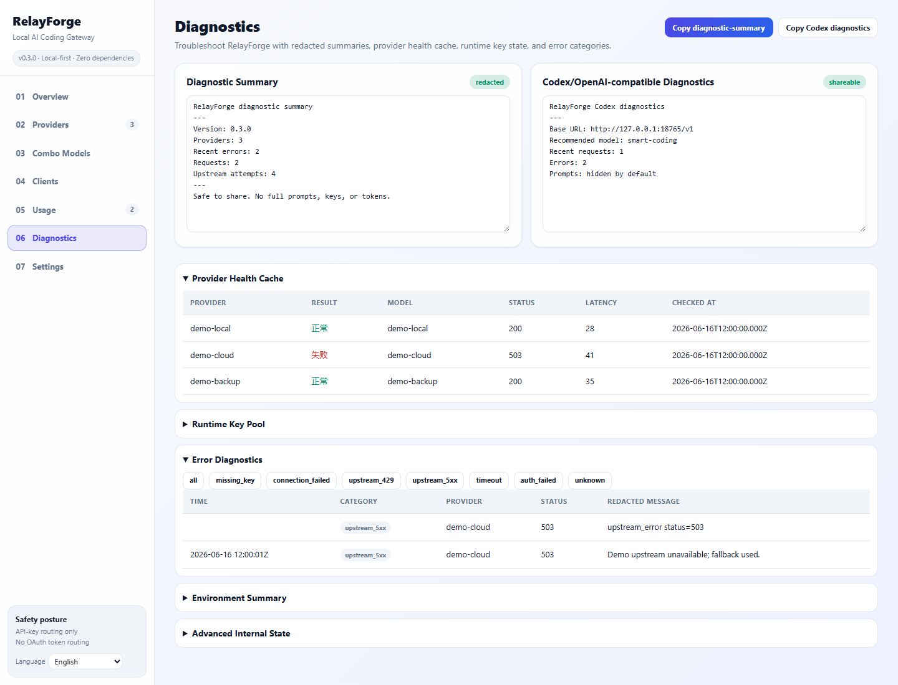
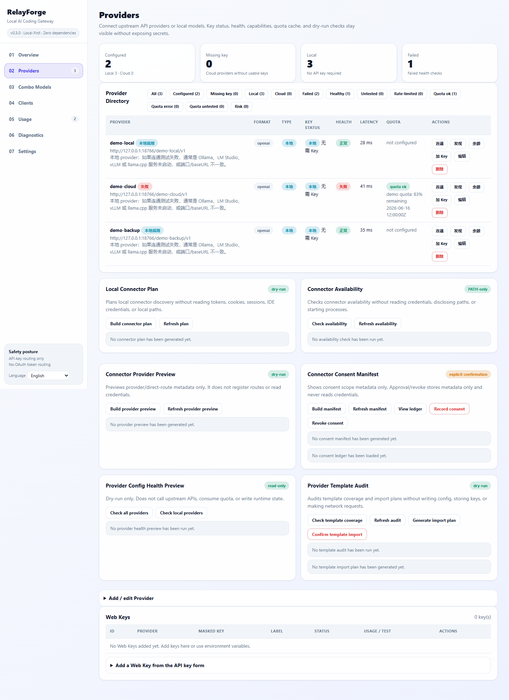
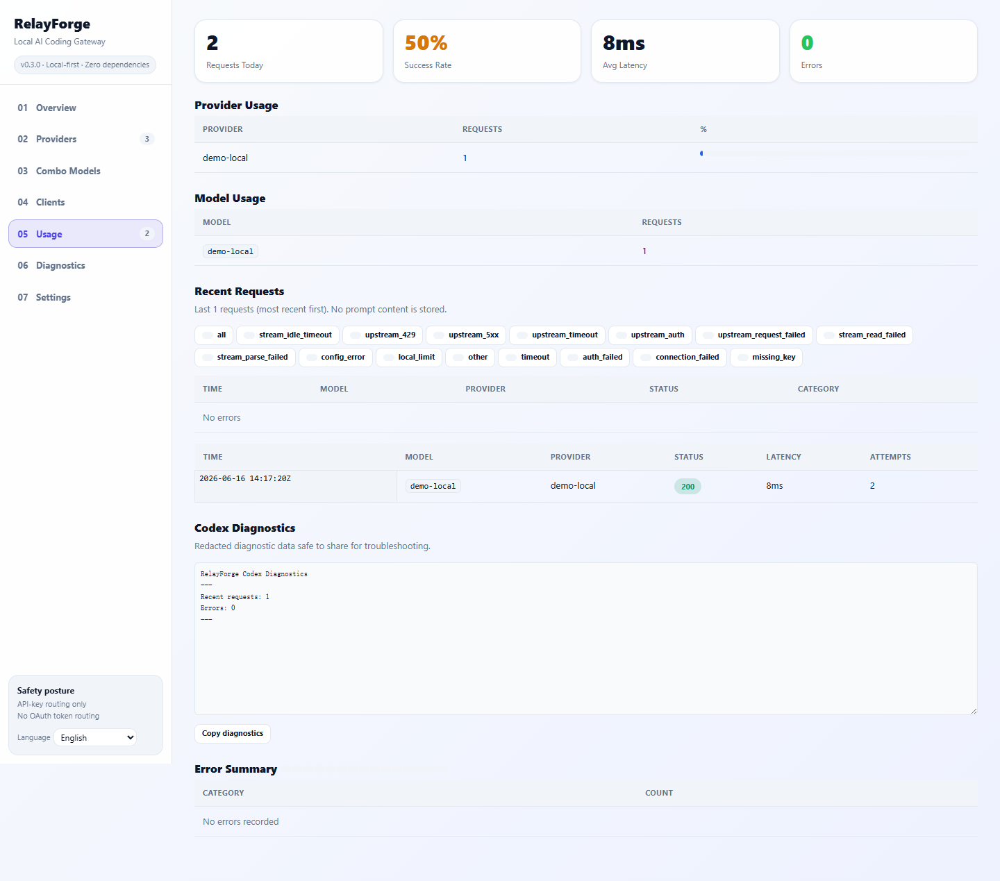
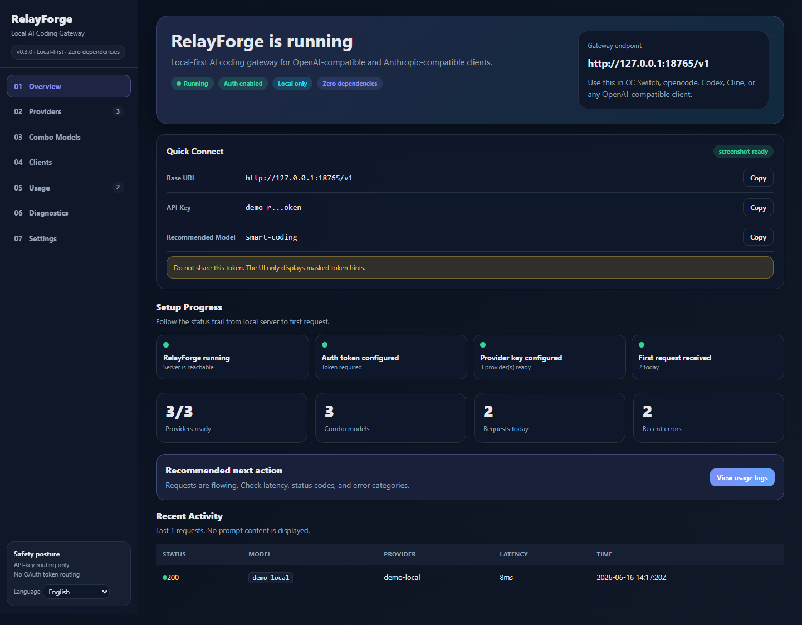
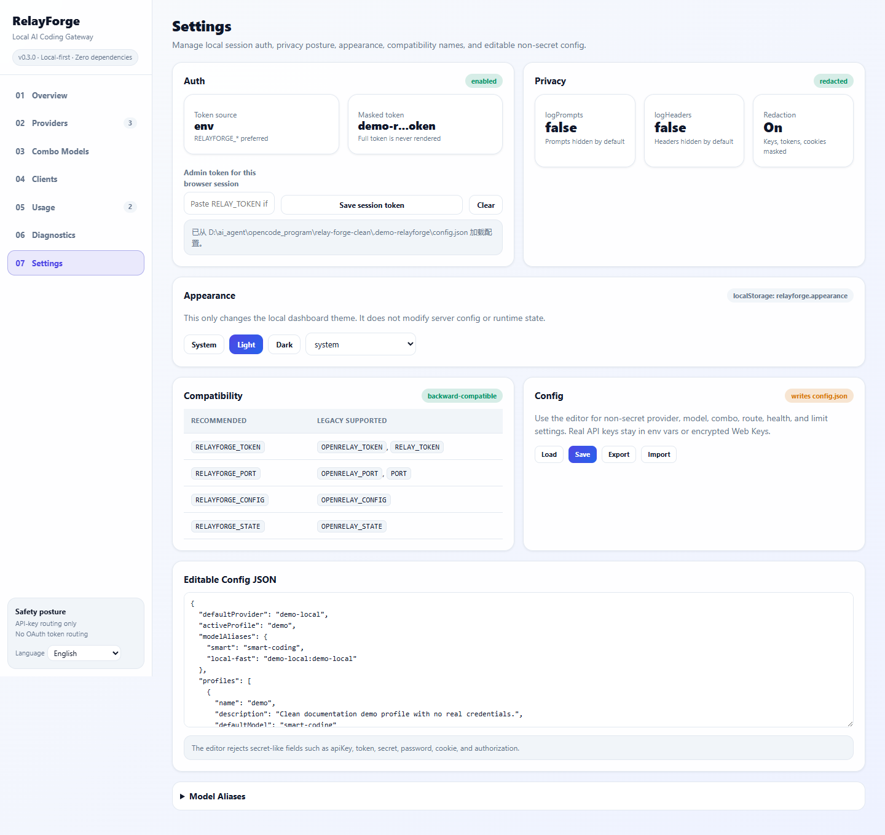
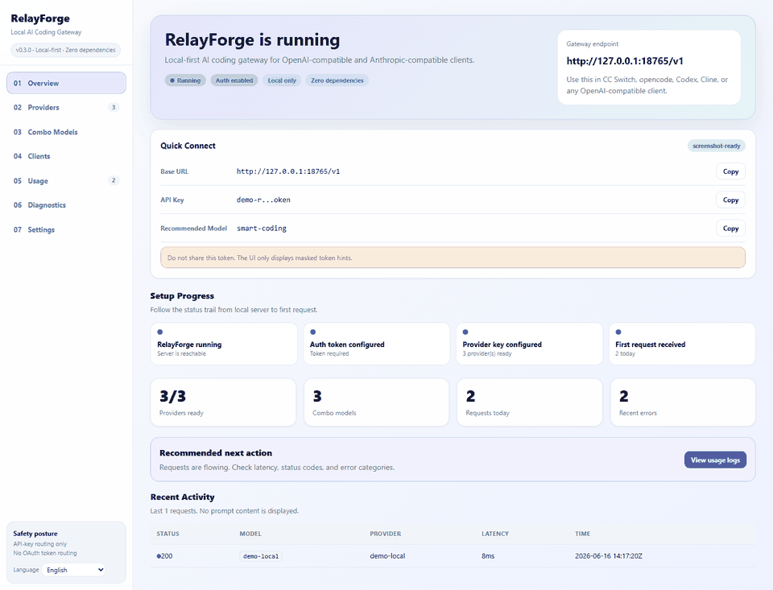

# RelayForge v0.3.0

**零依赖、本地优先的 AI 编程网关** - 兼容 OpenAI / Anthropic 接口。
RelayForge 可以把本地模型（Ollama / LM Studio）和云端 API providers 统一到 `http://127.0.0.1:18765/v1` 后面，并提供 combo 路由、fallback、请求隐私保护和轻量用量统计。

[](https://github.com/jiezeng2004-design/relay-forge/actions/workflows/ci.yml)
[](LICENSE)
[](package.json)
[]()
[]()

---

## 核心特性

- **Premium Dashboard UX** - v0.3.0 提供截图就绪的 Overview、Providers、Combo Models、Clients、Usage、Diagnostics 和 Settings 页面，并支持 light / dark / system 外观。
- **零依赖** - 只使用 Node.js 内置模块。
- **本地优先** - 默认绑定 `127.0.0.1`，无遥测、无云端锁定。
- **OpenAI / Anthropic 兼容** - 支持 `/v1/chat/completions`、`/v1/messages`、`/v1/responses`、`/v1/models`。
- **Combo 模型** - 用一个虚拟模型名组合多个 provider，支持 fallback / round_robin / weighted_round_robin。
- **智能 fallback** - 上游 429、503 或超时后自动切换到下一个候选。
- **隐私默认保护** - 默认不记录 prompt，API key 自动脱敏。
- **最近请求记录** - 展示最近 20 条请求元数据（模型、provider、延迟、状态码），不包含 prompt 内容。
- **Provider 能力查询** - `/admin/status` 返回 provider capabilities。
- **不接入 OAuth 订阅 token** - 不读取或转发 Claude Code / Codex / Cursor 的个人登录 token。

## 截图与演示

以下图片来自 RelayForge v0.3.0 dashboard 的真实本地运行页面，使用干净 demo 配置和 demo token 截取。截图中不包含真实 API key、本机用户路径、真实 prompt 或私有日志。

| Overview | Combo Models |
| --- | --- |
|  |  |

| Clients | Diagnostics |
| --- | --- |
|  |  |

| Providers | Usage |
| --- | --- |
|  |  |

深色模式和设置页：

| Dark Overview | Settings |
| --- | --- |
|  |  |

演示：



## 快速开始

### A. Windows zip 用户

1. 解压 `relayforge-0.3.0.zip`
2. 双击 **`Start_RelayForge.cmd`**
3. 打开 http://127.0.0.1:18765
4. 从启动日志中复制 token
5. 在 AI 编程工具里配置：
   ```
   Base URL: http://127.0.0.1:18765/v1
   API Key:  <RELAYFORGE_TOKEN from startup log>
   Model:    smart-coding
   ```

### B. PowerShell 用户

```powershell
$env:RELAYFORGE_TOKEN = "my-local-token"
$env:RELAYFORGE_PORT  = "18765"
node src/server.js
```

### C. macOS / Linux / WSL 用户

```bash
export RELAYFORGE_TOKEN="my-local-token"
export RELAYFORGE_PORT="18765"
node src/server.js
```

### D. 用 curl 验证

```bash
# 列出模型
curl http://127.0.0.1:18765/v1/models \
  -H "Authorization: Bearer my-local-token"

# Chat completion
curl http://127.0.0.1:18765/v1/chat/completions \
  -H "Authorization: Bearer my-local-token" \
  -H "Content-Type: application/json" \
  -d '{"model":"smart-coding","messages":[{"role":"user","content":"Hello!"}]}'

# 管理状态
curl http://127.0.0.1:18765/admin/status \
  -H "Authorization: Bearer my-local-token"
```

## 客户端配置

### CC Switch

```
Name: RelayForge
Base URL: http://127.0.0.1:18765/v1
API Key: <RELAYFORGE_TOKEN>
Model: smart-coding（或任意 combo / route / provider:model）
```

### opencode

```json
{
  "agents": {
    "defaults": {
      "model": { "primary": "smart-coding" }
    }
  },
  "models": {
    "providers": {
      "relayforge": {
        "baseUrl": "http://127.0.0.1:18765/v1",
        "apiKey": "<RELAYFORGE_TOKEN>",
        "api": "openai-completions",
        "models": [{ "id": "smart-coding" }]
      }
    }
  }
}
```

### Codex / OpenAI 兼容客户端

```bash
export OPENAI_BASE_URL="http://127.0.0.1:18765/v1"
export OPENAI_API_KEY="<RELAYFORGE_TOKEN>"
```

### Claude Code（OpenAI 兼容模式）

```bash
export ANTHROPIC_BASE_URL="http://127.0.0.1:18765/v1"
export ANTHROPIC_API_KEY="<RELAYFORGE_TOKEN>"
```

> **安全提示：** RelayForge 使用 API key 方式配置 provider。它不会读取或转发 Claude Code、Codex、Cursor 的 OAuth 订阅 token。上游 provider 凭证始终由你自己控制。

## 配置

### Providers

```json
{
  "providers": [
    { "name": "ollama", "baseUrl": "http://127.0.0.1:11434/v1", "models": ["qwen2.5:7b"] },
    { "name": "deepseek", "baseUrl": "https://api.deepseek.com/v1", "keyEnv": "DEEPSEEK_API_KEYS", "models": ["deepseek-chat"] }
  ]
}
```

### Routes

Routes 用来定义具名模型组，可以使用 fallback、round_robin 或 weighted 策略：

```json
{
  "routes": [{
    "name": "coding-local",
    "strategy": "fallback",
    "candidates": [
      { "provider": "deepseek", "model": "deepseek-chat", "weight": 3 },
      { "provider": "ollama", "model": "qwen2.5:7b", "weight": 1 }
    ]
  }]
}
```

### Combo 模型

```json
{
  "combos": [{
    "name": "smart-coding",
    "strategy": "fallback",
    "candidates": [
      { "provider": "deepseek", "model": "deepseek-chat", "weight": 3, "priority": 2, "enabled": true },
      { "provider": "groq", "model": "llama-3.1-8b-instant", "weight": 2, "priority": 1, "enabled": true },
      { "provider": "ollama", "model": "qwen2.5:7b", "weight": 1, "priority": 0, "enabled": true }
    ]
  }]
}
```

### 隐私

```json
{
  "privacy": {
    "logPrompts": false,
    "logHeaders": false
  }
}
```

默认不会把 prompt 存到 Dashboard 日志中。

## 环境变量

| 变量 | 推荐 | 旧变量（向后兼容） |
| --- | --- | --- |
| `RELAYFORGE_TOKEN` | 是，`/v1/*` 和 `/admin/*` 的认证 token | `RELAY_TOKEN` / `OPENRELAY_TOKEN` |
| `RELAYFORGE_CONFIG` | 是，自定义配置路径 | `OPENRELAY_CONFIG` |
| `RELAYFORGE_STATE` | 是，自定义状态路径 | `OPENRELAY_STATE` |
| `RELAYFORGE_PORT` | 是，端口配置 | `PORT` / `OPENRELAY_PORT` |
| `RELAYFORGE_ALLOW_NO_AUTH` | 是，仅开发时关闭认证 | `OPENRELAY_ALLOW_NO_AUTH` |

如果同时设置 `RELAYFORGE_*` 和 `OPENRELAY_*`，优先使用 `RELAYFORGE_*`。

## 设计重点

| 重点 | RelayForge |
| --- | --- |
| 运行时依赖 | 零 npm 依赖 |
| 默认暴露范围 | localhost 优先 |
| prompt 日志 | 默认关闭 |
| API-key 路由 | 通过本地 provider 配置支持 |
| OAuth 订阅 token 路由 | 设计上不支持 |
| 许可证 | MIT |

## 路线图

### v0.3.0 已完成

- Dashboard UX 重新设计
- 客户端配置卡片
- Usage、Diagnostics、Settings 页面
- light / dark / system 外观模式
- 更安全的本地优先配置和诊断

### 下一阶段：v0.4.x

- Docker 支持
- 配置导入 / 导出
- Provider 健康检查 UI
- 更多客户端预设
- 发布包打磨

### 不计划支持

- OAuth 订阅 token 路由
- 云端密钥同步
- 内置账号共享
- 绕过 provider 速率限制
- 默认存储完整 prompt

---

[MIT License](LICENSE) | [Third Party Notices](THIRD_PARTY_NOTICES.md) | [Release Notes](docs/release-v0.3.0.md)
